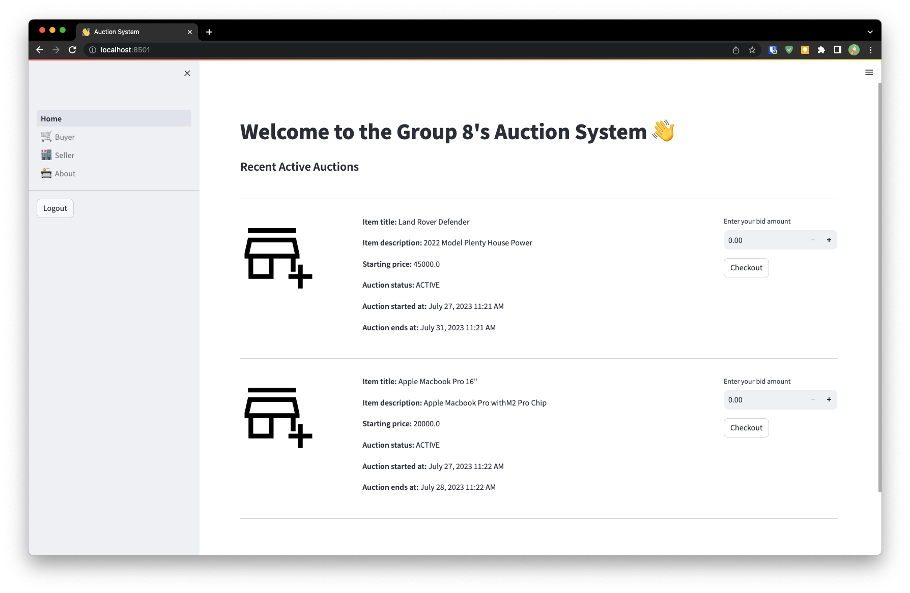

# DISTRIBUTED AUCTION SYSTEM

CSCD 604: DISTRIBUTED SYSTEM

COURSE WORK 2  - Distributed Auction System

## Group 8 Contributors

| Student                 | ID Number                 |
| :---------------------- | :------------------------ |
| TAMATEY, ABRAHAM        | 110*****                  |
| PEASAH-DARKWAH, EMMANUEL| 110*****                  |
| A*****, G*****          | 110*****                  |
| JOHNSON, MICHAEL KWAME  | 110*****                  |
| BARNES, OBED            | 110*****                  |
| KUDROHA, GIDEON KWAME   | 110*****                  |
| TAMEKLOE, PASCAL A.     | 110*****                  |

## Getting Started

Clone repository to your local and navigate into the folder

```bash
git clone https://github.com/horlali/distributed-auction-system
cd distributed-auction-system/
```

Create  and fill out the environment variable files

```bash
cp .env.example .env
```

## Dev Toolchain

- [python ^3.11](https://www.python.org/) main programming language
- [poetry](https://python-poetry.org/) for dependency management
- [pytest](https://docs.pytest.org/en/stable/) for testing
- [coverage](https://coverage.readthedocs.io/en/coverage-5.5/) for test coverage
- [black](https://github.com/psf/black) for code styling
- [isort](https://pycqa.github.io/isort/) for import sorting styling
- [flake8](https://flake8.pycqa.org/en/latest/) for linting

## Setup Local Environment

It is preferable to create and activate a virtual environment before installing the dependencies. You can read more about python virtual environments and how to create and activate it [here](https://realpython.com/python-virtual-environments-a-primer/)

Since poetry is used for dependency management, you need to have it installed first. You can read more about poetry and how to install it [here](https://python-poetry.org/docs/#installation). Or you can install it with the command below.

WSL, Linux or MacOS

```bash
curl -sSL https://install.python-poetry.org | python3 -
```

Windows

```bash
(Invoke-WebRequest -Uri https://install.python-poetry.org -UseBasicParsing).Content | py -
```

Once poetry is installed, run the command below in your activated environment to install the dependencies

```bash
poetry install
```

## Make Scripts Executable

```bash
chmod +x scripts/*
```

## Running Servers

In the root of the repository `:~/distributed-auction-system` run the server scripts below

```bash
./scripts/run-server.sh
```

whilst the server is running open another terminal and run the client script

```bash
./scripts/run-client.sh
```

The above command runs the apps on localhost:8501

## Sample Screenshots

Visiting the localhost:8501 in the browser will show the following page


After logging in or signing up, the following page will be shown


## Application Architecture

### Database Architecture

[Database ER Diagram](/docs/erDiagram.md)

### Auctions and Bid Object Architecture

[Auctions and Bids Class Diagram](/docs/auctions_class_diagram.md)

### Authtenticator Architecture

[Authenticator Class Diagram](/docs/auth_class_diagram.md)

### Home Page Flow Architecture

[Home Page Flow Diagram](/docs/home_page_flow.md)
