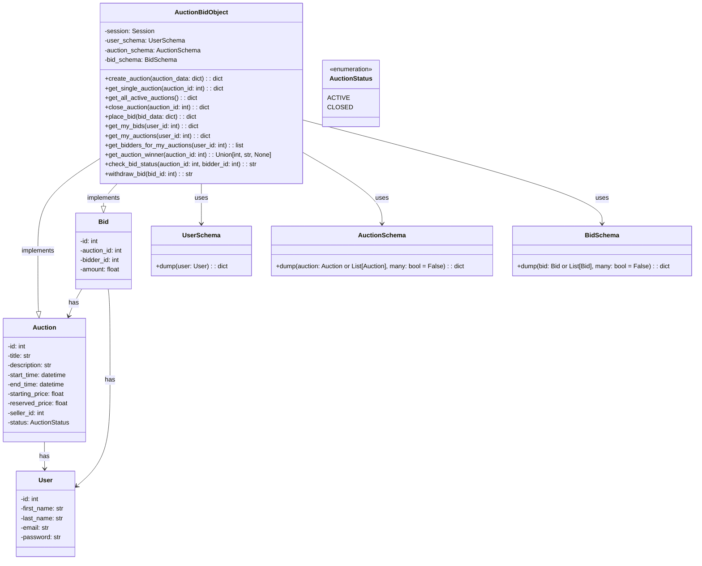

# Auctions and Bids Object - Class Diagram

```mermaid
classDiagram
    class AuctionBidObject {
        -session: Session
        -user_schema: UserSchema
        -auction_schema: AuctionSchema
        -bid_schema: BidSchema
        +create_auction(auction_data: dict): dict
        +get_single_auction(auction_id: int): dict
        +get_all_active_auctions(): dict
        +close_auction(auction_id: int): dict
        +place_bid(bid_data: dict): dict
        +get_my_bids(user_id: int): dict
        +get_my_auctions(user_id: int): dict
        +get_bidders_for_my_auctions(user_id: int): list
        +get_auction_winner(auction_id: int): Union[int, str, None]
        +check_bid_status(auction_id: int, bidder_id: int): str
        +withdraw_bid(bid_id: int): str
    }
    class Auction {
        -id: int
        -title: str
        -description: str
        -start_time: datetime
        -end_time: datetime
        -starting_price: float
        -reserved_price: float
        -seller_id: int
        -status: AuctionStatus
    }
    class Bid {
        -id: int
        -auction_id: int
        -bidder_id: int
        -amount: float
    }
    class User {
        -id: int
        -first_name: str
        -last_name: str
        -email: str
        -password: str
    }
    class AuctionStatus {
        <<enumeration>>
        ACTIVE
        CLOSED
    }
    class UserSchema {
        +dump(user: User): dict
    }
    class AuctionSchema {
        +dump(auction: Auction or List[Auction], many: bool = False): dict
    }
    class BidSchema {
        +dump(bid: Bid or List[Bid], many: bool = False): dict
    }
    AuctionBidObject --|> Auction : implements
    AuctionBidObject --|> Bid : implements
    AuctionBidObject --> UserSchema : uses
    AuctionBidObject --> AuctionSchema : uses
    AuctionBidObject --> BidSchema : uses
    Bid --> Auction : has
    Bid --> User : has
    Auction --> User : has
```
