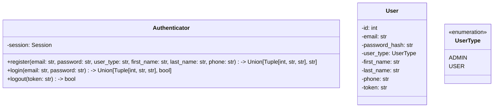

# ER Diagram

```mermaid
classDiagram
    class Authenticator {
        -session: Session
        +register(email: str, password: str, user_type: str, first_name: str, last_name: str, phone: str) -> Union[Tuple[int, str, str], str]
        +login(email: str, password: str) -> Union[Tuple[int, str, str], bool]
        +logout(token: str) -> bool
    }
    class User {
        -id: int
        -email: str
        -password_hash: str
        -user_type: UserType
        -first_name: str
        -last_name: str
        -phone: str
        -token: str
    }
    class UserType {
        <<enumeration>>
        ADMIN
        USER
    }
```
