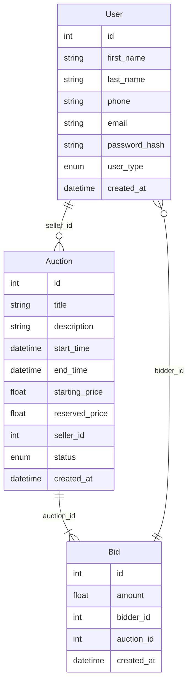

# ER Diagram

```mermaid
erDiagram
    User ||--o{ Auction : "seller_id"
    Auction ||--|{ Bid : "auction_id"
    Bid ||--o{ User : "bidder_id"

    User {
        int id
        string first_name
        string last_name
        string phone
        string email
        string password_hash
        enum user_type
        datetime created_at
    }
    Auction {
        int id
        string title
        string description
        datetime start_time
        datetime end_time
        float starting_price
        float reserved_price
        int seller_id
        enum status
        datetime created_at
    }
    Bid {
        int id
        float amount
        int bidder_id
        int auction_id
        datetime created_at
    }
```
